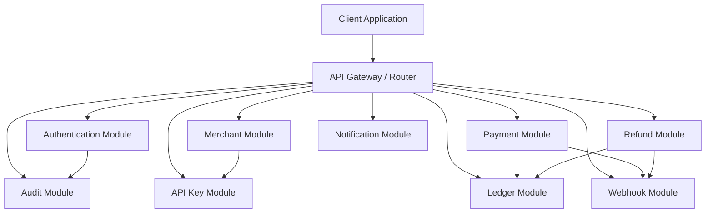
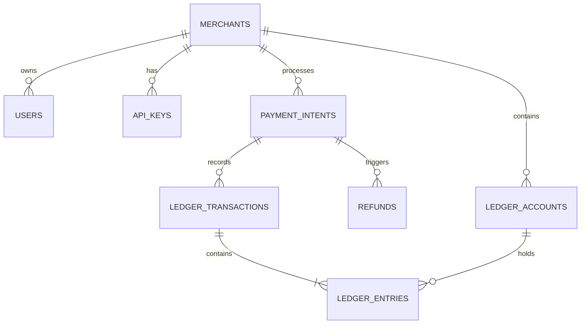
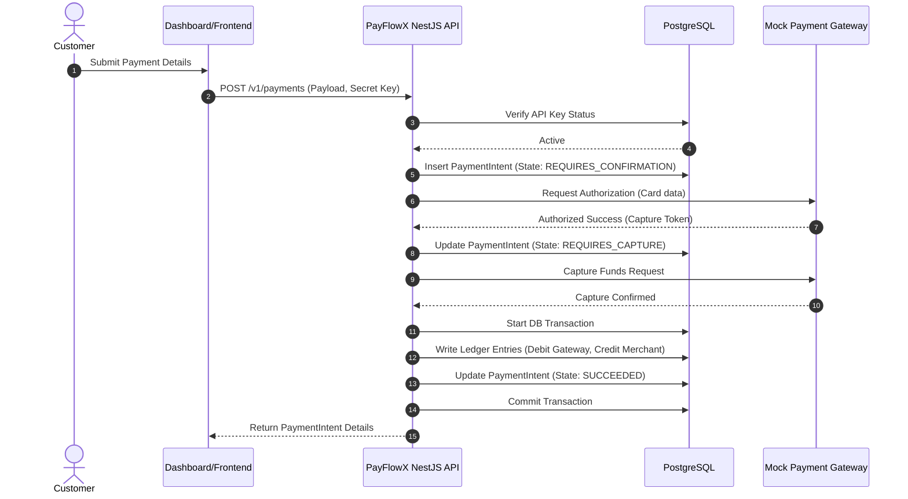
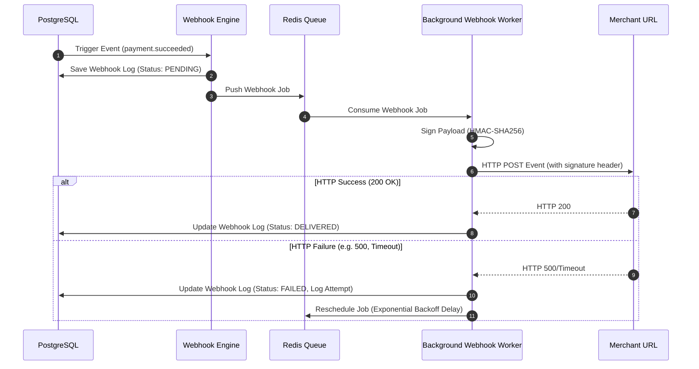

# Technical Design Document - PayFlowX

This document details the software architecture, domain boundaries, database design, and sequence flows of the PayFlowX modular monolith.

---

## 1. System Architecture: Modular Monolith
PayFlowX is structured as a **Modular Monolith**. Each module owns its own domain logic, controllers, services, repositories, and entities. Cross-module communication is strictly regulated to maintain low coupling.

---

## 2. Domain-Driven Design (DDD) Boundaries
To ensure clean division of responsibility, we establish strict **Bounded Contexts**:
- **Identity & Access Management (IAM) Context:** Contains `Auth` and `RBAC`. Handles user credentials, refresh tokens, and roles.
- **Merchant Operations Context:** Contains `Merchant` and `API Key`. Manages merchant identity and API credentials.
- **Transaction Engine Context:** Contains `Payment` and `Refund`. Handles processing states and interfaces with card networks.
- **Financial Ledger Context:** Contains `Ledger`. Strict balance sheets representing actual movement of funds.
- **Event Notification Context:** Contains `Webhook` and `Notification`. Handles outbound event delivery, signatures, and retries.
- **Compliance & Operations Context:** Contains `Audit`. Captures operational trail of system events.

---

## 3. Database Schema Design (PostgreSQL)
We use PostgreSQL for transaction management. The ledger accounts use TypeORM entities mapped to Postgres tables.

### Table Definitions & Indices

#### `merchants`
- `id`: `UUID` (Primary Key, default: `gen_random_uuid()`)
- `name`: `VARCHAR(255)`
- `status`: `VARCHAR(50)` (Values: `PENDING_VERIFICATION`, `ACTIVE`, `SUSPENDED`)
- `created_at`: `TIMESTAMP WITH TIME ZONE`
- `updated_at`: `TIMESTAMP WITH TIME ZONE`

#### `users`
- `id`: `UUID` (Primary Key)
- `email`: `VARCHAR(255)` (Unique Index)
- `password_hash`: `VARCHAR(255)`
- `role`: `VARCHAR(50)` (Values: `ADMIN`, `MERCHANT_OWNER`, `MERCHANT_USER`)
- `merchant_id`: `UUID` (Foreign Key -> `merchants.id`, Nullable for Admins)
- `created_at`: `TIMESTAMP WITH TIME ZONE`

#### `api_keys`
- `id`: `UUID` (Primary Key)
- `merchant_id`: `UUID` (Foreign Key -> `merchants.id`)
- `public_key`: `VARCHAR(255)` (Unique Index)
- `secret_key_hash`: `VARCHAR(255)` (HMAC/One-way hash)
- `status`: `VARCHAR(50)` (Values: `ACTIVE`, `REVOKED`)
- `expires_at`: `TIMESTAMP WITH TIME ZONE`
- `created_at`: `TIMESTAMP WITH TIME ZONE`

#### `payment_intents`
- `id`: `UUID` (Primary Key)
- `merchant_id`: `UUID` (Foreign Key -> `merchants.id`)
- `amount`: `NUMERIC(20, 4)`
- `currency`: `VARCHAR(3)`
- `status`: `VARCHAR(50)`
- `payment_method`: `JSONB`
- `created_at`: `TIMESTAMP WITH TIME ZONE`
- `updated_at`: `TIMESTAMP WITH TIME ZONE`
- *Index:* `idx_payment_intents_merchant_status` on (`merchant_id`, `status`)

#### `ledger_accounts`
- `id`: `UUID` (Primary Key)
- `merchant_id`: `UUID` (Foreign Key -> `merchants.id`)
- `type`: `VARCHAR(50)` (Values: `CUSTOMER`, `GATEWAY`, `MERCHANT`)
- `currency`: `VARCHAR(3)`
- `balance`: `NUMERIC(20, 4)`
- `created_at`: `TIMESTAMP WITH TIME ZONE`
- `updated_at`: `TIMESTAMP WITH TIME ZONE`
- *Index:* Unique Index on (`merchant_id`, `type`, `currency`)

#### `ledger_transactions`
- `id`: `UUID` (Primary Key)
- `reference_type`: `VARCHAR(50)` (Values: `PAYMENT`, `REFUND`)
- `reference_id`: `UUID` (Id of payment or refund)
- `created_at`: `TIMESTAMP WITH TIME ZONE`

#### `ledger_entries`
- `id`: `UUID` (Primary Key)
- `ledger_transaction_id`: `UUID` (Foreign Key -> `ledger_transactions.id`)
- `ledger_account_id`: `UUID` (Foreign Key -> `ledger_accounts.id`)
- `type`: `VARCHAR(10)` (Values: `DEBIT`, `CREDIT`)
- `amount`: `NUMERIC(20, 4)`
- `created_at`: `TIMESTAMP WITH TIME ZONE`

---

## 4. Sequence Diagrams

### Payment Confirmation (Create -> Authorize -> Capture)

### Webhook Event Dispatching with Retry Engine

